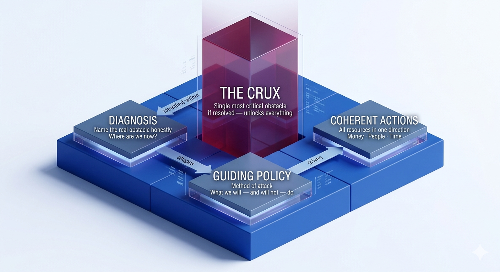
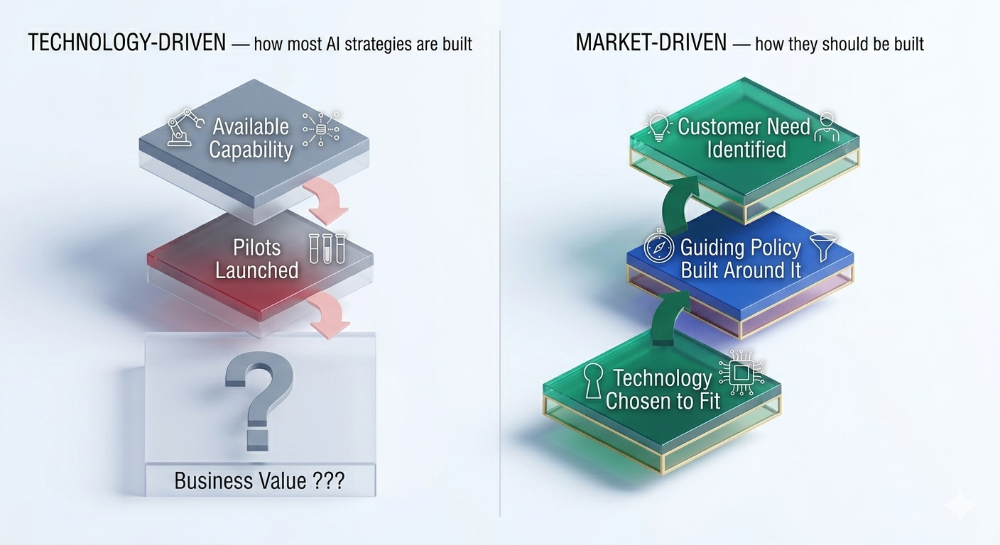
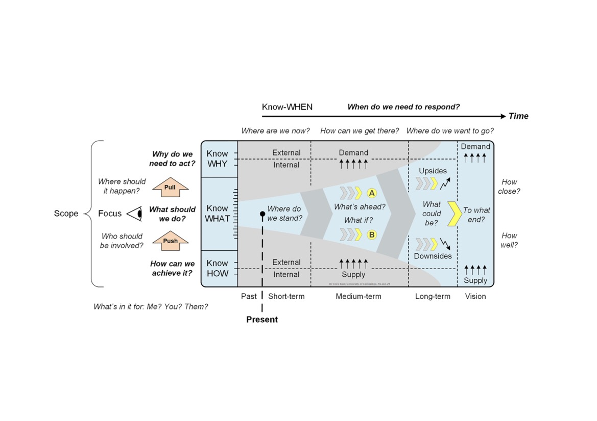
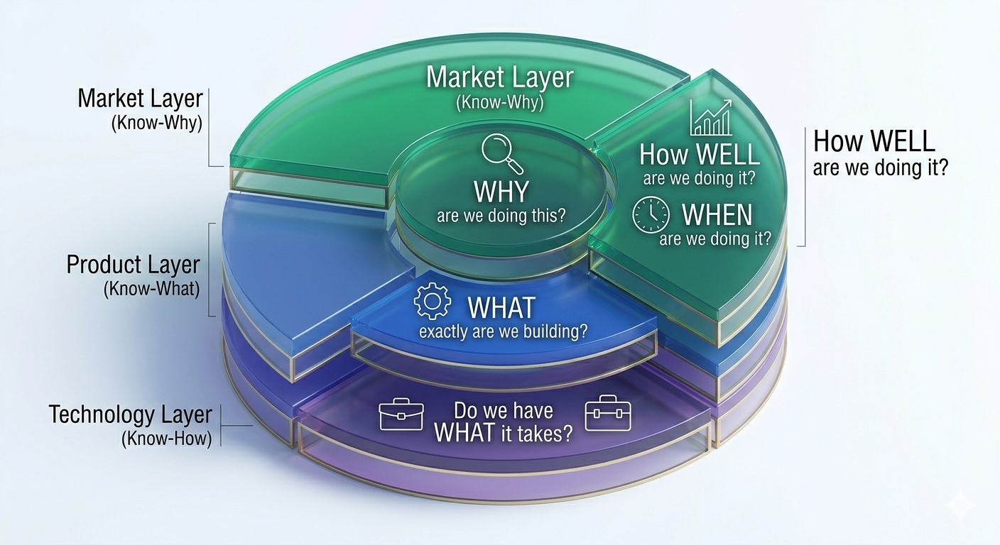

AI investment is surging driven by board mandates, competitive fear, and the pressure of not being left behind, yet most organisations have very little to show for it. It is the organisation that deploys a chatbot because the board asked for "an AI initiative," celebrates the launch, and calls it transformation.

The problem is not a lack of ambition. It is a confusion between *wanting* something and knowing *how* to get it. "We will grow AI-driven revenue by 30%" is not a strategy. It is a goal. And when organisations commit technology budgets on the basis of a goal dressed up as strategy, they are not investing. They are hoping.

There is a framework that explains exactly why and what to do instead. Chapter 5 of Richard Rumelt's *Good Strategy / Bad Strategy* [@Rumelt2011] gets to the heart of this. Rumelt argues that a real strategy is a tool for overcoming obstacles, not a vision statement, not a goal, not a budget. He calls the structure behind it the **strategic kernel** with three key elements that must work together: A **diagnosis** that names the real obstacle honestly, a **guiding policy** that decides how to attack it, and **coherent actions** that point every resource, money, people, time in the same direction, as illustrated in @fig-kernel.

{#fig-kernel fig-align="center" width="75%"}

The kernel gives you the structure. But in *The Crux* [@Rumelt2022], Rumelt adds a sharper demand: within your diagnosis, you must identify the **crux**, the one obstacle that, if removed, unlocks everything else. Most organisations sense where it lies. They just choose not to go there. Instead, they build strategy *around* it while the real obstacle sits untouched.

Nowhere is this more visible than in enterprise AI. Despite unprecedented investment, 80% of organisations are running pilots, yet only 5% have extracted measurable value [@Joshi2026; @MLQ2025]. That gap is not a technology failure, it is a strategy failure, and often a double one. The kernel is rarely applied properly: no honest diagnosis, no real guiding policy, just a list of initiatives dressed up as direction. Without the kernel, the crux goes unfound. The result is not merely effort pointed at the wrong problem. It is effort that is not pointed at anything at all.

What makes AI a particularly acute case is not that organisations are less competent or less ambitious than in other technology waves. It is that AI has structural properties that actively resist each element of the kernel in ways that cloud adoption, ERP, or even the early internet did not. Understanding those properties explored in the next section is what separates a framework that produces a coherent AI strategy from one that merely looks like one.

The question is therefore how to build a strategy framework that is explicitly designed for those structural properties, not one borrowed from a different technology era. That is where **technology roadmapping** comes in. At its core, a technology roadmap is a structured visual framework that aligns market needs, business objectives, and technology capabilities across time [@Phaal2004]. It is not a project plan or a feature backlog, it is a strategic instrument that forces the hard questions: why are we doing this, what exactly are we building, and do we have what it takes [@Phaal2010]? When built around the kernel, it becomes the mechanism that translates diagnosis into direction and direction into coherent action.

This post, the first of two, exploring how combining Rumelt's strategic kernel with a structured technology roadmapping process [@Komssi2013; @o2021agile] can close that gap by giving organisations the tools to find the crux, build a guiding policy around it, and take actions that are genuinely coherent rather than merely busy. [Part 2](../04/index.qmd) puts the framework into practice with a five-step AI roadmapping process and a guide to spotting bad AI strategy before it costs you.

## Why AI Is Not Just Another Technology Initiative

Before reaching for any framework, it is worth being precise about what makes AI *structurally* harder to strategise around than previous technology waves. The failure rate is not simply the result of organisations applying bad strategy. It is the result of AI having three properties that actively resist the strategy discipline that worked well enough for cloud, ERP, or even the early internet.

**The diagnosis problem is inverted.** With most technologies, an organisation identifies a problem and evaluates whether a technology can solve it. With AI, the sequence is frequently reversed: a capability becomes visible  a language model, a computer vision API, a predictive analytics platform  and the organisation then goes looking for a problem it might solve. This is not carelessness. It is a rational response to a technology that is genuinely novel and whose applications are not yet obvious [@Agrawal2022]. But it means that diagnosis, the first and most critical element of the kernel, is being done *after* the solution has already been chosen. The result is that the crux, the real obstacle blocking value, is rarely identified at all. In most AI initiatives, the crux is not the model. It is data quality, or decision rights, or the absence of a workflow the model can actually integrate into. Because the diagnosis started from the technology rather than the obstacle, none of those things are visible until after the budget is spent.

**The guiding policy has a shorter half-life.** A guiding policy is only as durable as the assumptions it rests on. In conventional technology strategy, those assumptions are reasonably stable: the capabilities available in year one are recognisably similar in year three. AI breaks this. The underlying capability frontier is moving faster than most organisations' planning cycles what @Mollick2024 calls the "jagged frontier," where capabilities advance unevenly and unpredictably across domains. A guiding policy calibrated to what large language models could do in 2022 was already structurally wrong by 2024. This is not a failure of foresight  it is a property of the technology [@Suleyman2023]. It means that the strategic intent behind any AI roadmap decays faster than it would for any previous generation of enterprise technology, and that roadmaps built with a conventional three-to-five year horizon are, by construction, planning with assumptions that will not hold.

**Value is indirect, emergent, and hard to attribute.** With ERP or cloud infrastructure, a cost model can be constructed in advance and the outcome measured against it. AI value frequently does not work this way. It surfaces in productivity gains that are difficult to isolate, in decisions that are marginally better but not obviously so, or in capabilities that enable second-order opportunities that were not anticipated at the outset [@Iansiti2020]. This breaks the roadmap's ability to tell you whether your strategy is actually working. Helmer's concept of **Process Power** [@Helmer2016] helps explain why: AI value accumulates through proprietary workflows and embedded decision-making that competitors cannot easily replicate, not at the point of model deployment. When organisations measure AI by models deployed or pilots completed, they are measuring the wrong layer entirely. When value is emergent and attribution is contested, organisations either declare success on the basis of activity rather than outcome, or they abandon initiatives that are quietly working because the proof is hard to assemble. Both are consequences of measuring an emergent technology with instruments built for predictable ones.

These three properties do not mean AI is unstrategisable. They mean that a framework applied to AI needs to be explicitly designed to handle them  a diagnosis process that can work when the crux is obscured by vendor-led framing, a guiding policy that is built to be revised rather than fixed, and a performance layer that can hold ambiguity without collapsing into vanity metrics. That is precisely what combining the kernel with a structured roadmapping process makes possible. But only if the combination is built with these failure modes in view.

## Why Most AI Roadmaps Fail - and What the Kernel Changes

Each of those three structural properties has a direct expression in how AI roadmaps are typically built and why they fail. The failure starts before the roadmap is drawn. IBM reports that 64% of CEOs admit to investing in technology before fully understanding its potential impact [@IBM2025]. There are two ways this goes wrong. The first is a *technology-driven* strategy starting with available capabilities and working backwards, hoping a business case materialises. The second, less obvious failure is waiting for perfect market insight before engaging with the technology at all. In AI, neither extreme works. The roadmapping literature points to a more disciplined path: one that starts with a real, felt problem, uses technology awareness to sharpen the diagnosis, and then asks what capabilities are genuinely required to solve it [@Vishnevskiy2016; @Noh2021], as shown in @fig-tech-vs-market.

{#fig-tech-vs-market fig-align="center" width="50%"}

To correct this, organisations need a roadmap that starts with a real problem not with an available capability. In AI, this does not mean ignoring what the technology makes possible. It means using that awareness as an input to diagnosis, not as a substitute for it. According to @Phaal2010, a roadmap only becomes truly strategic when it honestly addresses five questions: **Why, What, How, When, and How Well**. Without all five, you do not have a strategy - you have a to-do list with a Gantt chart attached, as shown in @fig-roadmap-gov.

{#fig-roadmap-gov fig-align="center" width="75%"}

What makes this combination powerful is how naturally Rumelt's three kernel elements map onto the roadmapping questions that @Kerr2022 identifies: *Where are we now? Where do we want to go? How can we get there?*  and onto the knowledge layers that @Phaal2004 describes. Rather than two separate frameworks running in parallel, they function as three lenses on the same strategic problem, each reinforcing the other, as shown in @tbl-kernel-map.

| Rumelt's Kernel | Roadmapping Question | Roadmap Layer | Strategic Focus |
|:---|:---|:---|:---|
| **Diagnosis** | Where are we now? | **Know-Why** | Market trends, value gaps, and identifying the "Crux" |
| **Guiding Policy** | Where do we want to go? | **Know-What** | Strategic intent, AI offerings, and business alignment |
| **Coherent Actions** | How can we get there? | **Know-How** | Skills, capabilities, and execution |
| **Coherent Actions** | When and how well? | **Know-When / How Well** | Timelines, milestones, performance metrics, and continuous review |

: **Integration of Rumelt's Kernel and Roadmapping Layers** {#tbl-kernel-map}

That mapping matters because it is not arbitrary, each row in the table is a direct response to one of the three structural AI challenges described earlier. The **Diagnosis / Know-Why** layer confronts the inverted diagnosis problem: by anchoring the process in market trends and value gaps, it forces the question of what problem actually needs solving before any capability is selected. The **Guiding Policy / Know-What** layer addresses policy decay: rather than a fixed strategic intent, it is designed to be revisited as the capability frontier shifts. The **Coherent Actions / Know-When / How Well** layer addresses emergent value: it replaces activity metrics with outcome-linked milestones that can hold ambiguity without collapsing into vanity measures.

The real value of strategic roadmapping is not the diagram you produce, it is the disciplined thinking the process forces you to do. When built around the kernel and properly facilitated [@Phaal2004; @Komssi2013], each element of the kernel finds its operational expression in the roadmap:

- **Honest prioritisation** : the crux drives resource allocation, countering the inverted diagnosis problem by forcing the real obstacle into view before capabilities are chosen.
- **Adaptive planning** : the "How Well" layer keeps the roadmap live — updating as the AI capability frontier shifts, rather than locking in assumptions that will not hold.
- **Managed experimentation** : coherent actions replace scattered pilots, each tied to a specific measurable question, making emergent value visible rather than declared.
- **Strategic alignment** : diagnosis and guiding policy ensure market, product, and technology investments pull in the same direction, not against each other.
- **Shared language** : the roadmap makes the kernel visible across diverse teams without requiring everyone to read the same strategy document.

The layered nature of this framework; Market, Product, and Technology working together - is shown in @fig-kernel-strategy.

{#fig-kernel-strategy fig-align="center" width="65%"}

The question is no longer whether to build a roadmap. It is whether to build one that actually works.

## Conclusion: The Kernel is the Roadmap, the Roadmap is the Kernel

AI is not simply a hard technology to deploy. It is a technology that structurally resists the strategy discipline that worked for every previous enterprise technology wave. It inverts the normal diagnostic sequence, shortens the useful life of any guiding policy, and produces value in forms that conventional measurement instruments cannot capture. These are not execution problems. They are design problems and they require a framework that is built with them in view.

That is what combining Rumelt's kernel with a structured technology roadmap provides. The kernel supplies the architecture: a diagnosis that names the real obstacle, a guiding policy built to be revised rather than fixed, and coherent actions measured by outcomes rather than activity. The roadmap supplies the operational mechanism: a structured process that forces the five strategic questions — Why, What, How, When, and How Well — and makes the kernel visible across the organisation, not just in the strategy document.

The gap between 80% running pilots and 5% extracting value is not a technology gap. It is a strategy gap created by frameworks that were not designed for AI's structural properties. And it is closeable but only if the framework is.

**[Part 2 →](../04/index.qmd)** walks through a concrete five-step AI roadmapping process built around the kernel and Phaal roadmapping framework, shows you how to run the diagnosis workshop that surfaces the crux, and gives you a practical checklist for recognising bad AI strategy before it costs you. If this post named the problem, Part 2 gives you the process to fix it.
