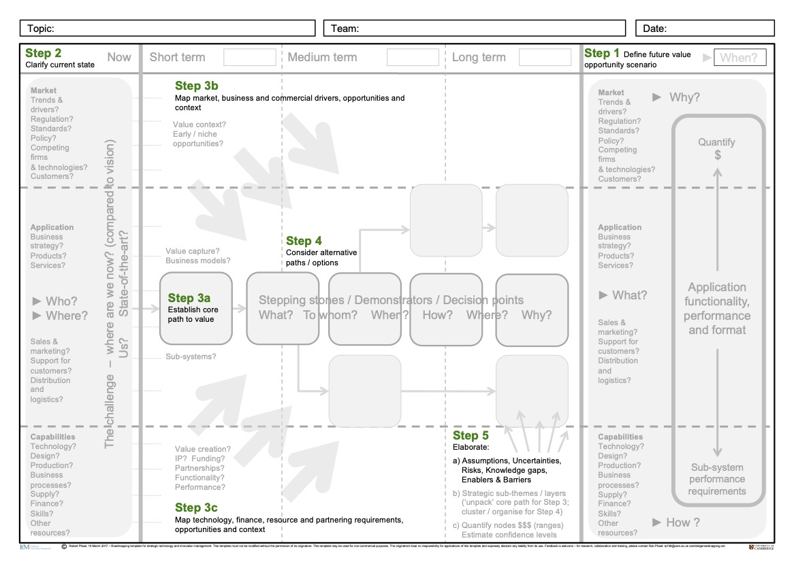
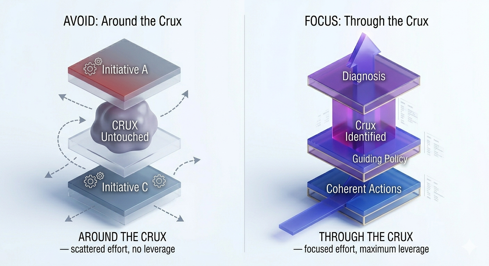

In [Part 1](../03/index.qmd), we established why most AI strategies fail: the kernel is missing. No honest diagnosis, no real guiding policy, just a list of initiatives dressed up as direction. We also showed how Rumelt's strategic kernel — diagnosis, guiding policy, coherent actions — maps directly onto the layers of a technology roadmap, giving organisations a disciplined path from problem to execution.

But knowing what the kernel requires is not enough. The harder question is how to operationalise it inside a real organisation under real constraints. That is what this post addresses: a five-step process for building an AI roadmap around the kernel, and a practical guide to recognising when a strategy is missing it entirely.

## Putting the Kernel to Work: A Five-Step AI Roadmapping Process

The five-step process outlined by @Phaal2010, depicted in @fig-roadmap-process, provides that structure, each step forcing an answer to one of the strategic questions the kernel demands. Questions, notably, that most AI strategies never seriously ask.

{#fig-roadmap-process fig-align="center" width="75%"}

### Step 1: Find the Crux Before You Build the Roadmap

This is the first half of Rumelt's **Diagnosis**, the kernel element that everything else depends on. In roadmapping terms, it is your **Know-Why**: the market need, the value gap, the reason this AI initiative exists at all. Without it, every subsequent step is pointed at the wrong destination.

Most organisations skip this step. Or rather, they think they have done it when they have not. Defining the value opportunity is not about writing a vision statement. It means identifying the **crux** [@Rumelt2022]: the single most critical obstacle that, if resolved, unlocks disproportionate value for the business. Not the most urgent problem. Not the easiest one to fix. The one that matters most.

Rumelt illustrates this with SpaceX. Making space travel economically viable involved dozens of obstacles — propulsion, materials, regulation, funding. But Musk did not treat them as equally urgent. He stopped and asked which one, if resolved, would make everything else tractable. The answer was clear: rockets were single-use. You built an enormously expensive machine, flew it once, and it was gone. That single diagnosis — not a list of priorities, not a vision statement — became the crux the entire SpaceX strategy was built around.

That is exactly what most AI strategies fail to do. They begin executing before they have finished diagnosing, treating data quality, talent gaps, and tooling choices as equally urgent problems, rather than stopping to ask which one, if resolved, changes everything else. Without that question answered, there is no crux. And without the crux, the roadmap has no anchor, as @fig-crux-avoidance illustrates.

{#fig-crux-avoidance fig-align="center" width="75%"}

This requires a shift in the question you are asking. Instead of *"How can we apply AI?"* ask *"What is the one challenge where AI gives us a unique, defensible advantage and where solving it changes everything?"* That answer is your **Know-Why** — the foundation of the entire roadmap [@verdin2015you; @burstrom2021ai].

Organisations that skip this step do not fail at execution. They fail at direction. They build technically impressive roadmaps pointed at the wrong destination.

### Step 2: Be Brutally Honest About Where You Are

Steps 1 and 2 together complete the kernel's **Diagnosis** element. Step 1 found the crux, the obstacle that matters most. This step builds the full picture: a candid assessment of where the organisation actually stands, which in roadmapping terms means grounding your **Know-Why** in reality rather than aspiration.

Honest diagnosis sounds straightforward. It is not. This step requires a candid assessment of your starting point: data maturity, technical infrastructure, organisational capabilities, and the regulatory landscape — wherever you actually are, not where you wish you were [@Kerr2022]. It answers the hardest of the three roadmapping questions: *Where are we now?*

@Deloitte2025 identifies overestimating data maturity as the primary cause of AI pilot failure. Organisations assume their data is cleaner, more complete, and better governed than it actually is. The result is a **"Data Poverty"** problem that surfaces only after budgets are committed and timelines are set. What makes this worse is that the gap is rarely visible from the top. As one practitioner in my research put it, *"there's an expectation at higher levels that data collection and analysis are simple, but they don't understand the granular steps involved in connecting, collecting, storing, visualising, and using the data."* The overconfidence is not carelessness — it is distance.

This matters beyond data quality alone. The current-state assessment must treat data as a strategic dimension in its own right — not just an input to clean up, but a capability to map: what data exists, how it is governed, how it can be integrated, and what value it can generate [@Phaal2004; @Komssi2013]. An AI strategy built on an incomplete picture of data capability will hit walls that were never mapped.

Rumelt illustrates what honest diagnosis looks like in *Good Strategy/Bad Strategy* [@Rumelt2011] through Andy Grove at Intel. By the mid-1980s, Intel's memory chip business was being destroyed by Japanese competition. Grove asked his leadership team a blunt question: if the board replaced them tomorrow, what would the new management do? The answer was obvious — exit memory and focus on microprocessors. But the existing team could not see it, because their identity was built around memory. The crux was clear to any honest observer. The organisation had built a strategy around not looking at it. Grove looked. Intel survived.

This step also asks the "How Well" question early [@burtonshaw2008essential]: does this organisation have the actual capacity to execute? Not the theoretical capacity — the real one. Getting this wrong at step two makes every subsequent step a fiction.

### Step 3: Turn Your Diagnosis Into a Direction

With Diagnosis complete — crux identified, current state honestly assessed — the kernel's second element comes into view: the **Guiding Policy**. This is the bridge between where you are and where you are choosing to go [@sjodin2020value]. In roadmapping terms, it is the **Know-What** layer: the tangible AI offerings, platforms, and initiatives that will deliver stakeholder value, defined clearly enough to make trade-offs possible.

But here is the part most strategy processes miss: a guiding policy is not a list of priorities. It is a *filter*. It tells you what to say yes to and, more importantly, what to say no to [@FRitala2013].

This step develops your core AI strategy across short, medium, and long-term horizons, identifying market drivers, financing requirements, technology choices, and the partnerships you will need. Without it, every initiative looks equally important. With it, you have a basis for making decisions under pressure.

Rumelt gives the clearest example of this in *Good Strategy/Bad Strategy* [@Rumelt2011] through Steve Jobs at Apple. When Jobs returned in 1997, Apple had dozens of products — computers, printers, peripherals, servers — each with its own team and roadmap. His diagnosis: the company was spreading itself into irrelevance. His guiding policy was not a new list of priorities. It was a decision to cut everything that did not fit a single matrix: consumer or professional, desktop or portable. Four products. Everything else gone. That choice made every subsequent decision simpler — not because it reduced complexity, but because it created a basis for saying no.

Musk's SpaceX did the same thing in an engineering context. Once the crux was clear — rockets are single-use — his guiding policy was not a list of capabilities to develop. It was one constraint: every engineering decision had to advance reusability. That single filter, like Jobs's product matrix, made every subsequent choice easier to make and easier to justify.

In my research, a common failure was confusing strategic roadmaps with product or feature delivery timelines. Teams produced detailed plans, but those plans described *what* would be built quarter by quarter, not *why* those choices advanced a coherent position. The guiding policy was missing. The roadmap was just a schedule with ambition attached.

### Step 4: Take Coherent Actions, Not Scattered Pilots

A guiding policy tells you what to pursue. Now comes the kernel's third element: **Coherent Actions** — and in AI, this is where most organisations discover that knowing what to pursue and knowing how to get there are two different things. This step is about designing that exploration deliberately, through the **Know-How** layer: the skills, partnerships, and capabilities assembled for the specific paths you are actually taking, not speculatively pre-built for paths you may never need.

At SpaceX, coherent actions meant pointing every resource — engineering, manufacturing, testing — at reusability alone. Not spread across propulsion improvements, material costs, and regulatory strategy simultaneously. At one obstacle. In AI, the discipline is the same: every pilot, every capability built, every hire should connect back to the crux identified in Step 1 and the guiding policy set in Step 3.

In practice, coherent actions in AI take the form of deliberate experiments — each one designed to test a specific assumption about the crux or validate a path toward the guiding policy. Two failure modes get in the way. The first is deploying a capability before the diagnosis is complete and hoping value follows. The second is waiting for perfect certainty before committing to any path. Neither is coherent. Coherent actions are question-driven: what do we need to learn, and what is the smallest experiment that answers it [@opresnik2015value; @shollo2022shifting]?

Organisations that treat coherent actions as questions rather than deliverables describe a recognisably different rhythm. As one respondent in my research explained, *"the strategy is to develop and implement small features incrementally... I began with preliminary data to create a basic application and then refined it based on feedback. This necessitates a committed business and a problem that can be developed in stages."* That is not just good product practice — it is what coherent action looks like in an AI context.

### Step 5: Build in the "How Well" From the Start

The final step is the one most organisations treat as an afterthought. It should not be — because this is what keeps the kernel honest over time. Diagnosis decays as markets shift. Guiding policies outlive their usefulness. Coherent actions can drift from discipline into habit. The **Know-When / How Well** layer exists to catch this: structured reviews that ask whether the crux has changed, whether the guiding policy still holds, and whether the actions remain genuinely coherent.

Keeping the roadmap dynamic is not an administrative task [@Phaal2004]. It is a strategic discipline. Given that AI ROI typically takes two to four years to materialise [@Deloitte2025], and that the landscape shifts faster than most planning cycles, regular review is not optional — it is how the kernel stays honest.

And critically — if the crux you identified in Step 1 is no longer the most important obstacle, the roadmap should say so. Honesty at this stage is not a sign of failure. It is a sign that the process is working [@Kerr2022].

That discipline extends to measurement itself. As one practitioner put it directly: *"metrics should be captured from day one — everyone in the team should understand and follow the process for creating and capturing value."* That is not overhead. That is accountability built into the kernel from the beginning, not retrofitted after the fact.

These five steps are what a real AI strategy looks like in practice. Knowing them also makes it easier to recognise when a strategy is missing them entirely.

## How to Spot a Bad AI Strategy

Most AI strategies fail for the same reasons, and they are not hard to spot once you know what to look for [@Rumelt2011; @Rumelt2022].

**Fluff.** Language like "leveraging disruptive GenAI synergies to unlock enterprise value" sounds authoritative. It means nothing. Fluff fills the space where an honest Diagnosis should be — it signals that the Know-Why was never seriously established. In practice, it tends to proliferate when leaders are under pressure to show AI progress without having named the actual problem. The language sounds strategic precisely because it is untestable.

**Avoiding the crux.** This is the most common failure at the Diagnosis stage, and Rumelt dedicates an entire book to it [@Rumelt2022]. Leaders sense that the real obstacle — poor data governance, a fragmented organisation, misaligned incentives — is too political or too painful to confront. So they build activity around it. Workshops are run. Pilots are launched. The crux remains untouched. In my research, a telling symptom was stakeholder disengagement: when executives are not meaningfully involved in the roadmapping process, there is no one with authority to name the real obstacle, and no one accountable for addressing it.

**Mistaking goals for strategy.** "We will achieve 20% revenue growth through AI" is not a strategy. It is a wish. A Guiding Policy tells you how to get there; a goal only tells you where you want to be. Without the former, there is no mechanism — no way of actually getting you there [@Rumelt2011]. The Know-What layer stays empty, and every initiative competes for priority because nothing has been ruled out.

**Feature roadmaps masquerading as strategy.** When the roadmap lists every AI feature to be built quarter by quarter but says nothing about why those choices advance a coherent position, it is not a strategic instrument — it is a delivery schedule. @Komssi2013 identifies this as one of the most persistent roadmapping failures: a focus on low-level features rather than the value proposition and outcomes the organisation is trying to achieve. The result is a roadmap that looks comprehensive but offers no basis for saying no. Every request gets added. Every pilot gets approved. The Coherent Actions layer fragments into a backlog, and the crux — the one obstacle that matters most — remains unaddressed because the roadmap was never designed to find it [@o2021agile].

## Conclusion

The AI Divide is not a technology problem. It is a strategy problem — specifically, the failure to build a real kernel: an honest diagnosis that finds the crux, a guiding policy that channels effort, and coherent actions that execute with discipline.

Strategic roadmapping is the mechanism that makes that kernel visible. It forces the hard questions — *Why are we doing this? What exactly are we building? Do we actually have what it takes?* — and structures the answers into something an organisation can act on, revisit, and adapt.

As I reflect on the organisations that have successfully navigated the shift from AI hype to measurable value, the pattern is consistent. They did not have better technology. They had better diagnosis. They understood what AI could do — and used that understanding to find the crux, build a roadmap around it, and hold themselves accountable to the "How Well" question every step of the way.

The organisation that deployed a chatbot and called it transformation still has a choice: keep hoping, or build a kernel.

The question worth asking yourself today is simple: does your organisation have a real AI strategy — with a diagnosis, a guiding policy, and coherent actions — or does it have a very polished wish list?

The answer matters more than the technology.
