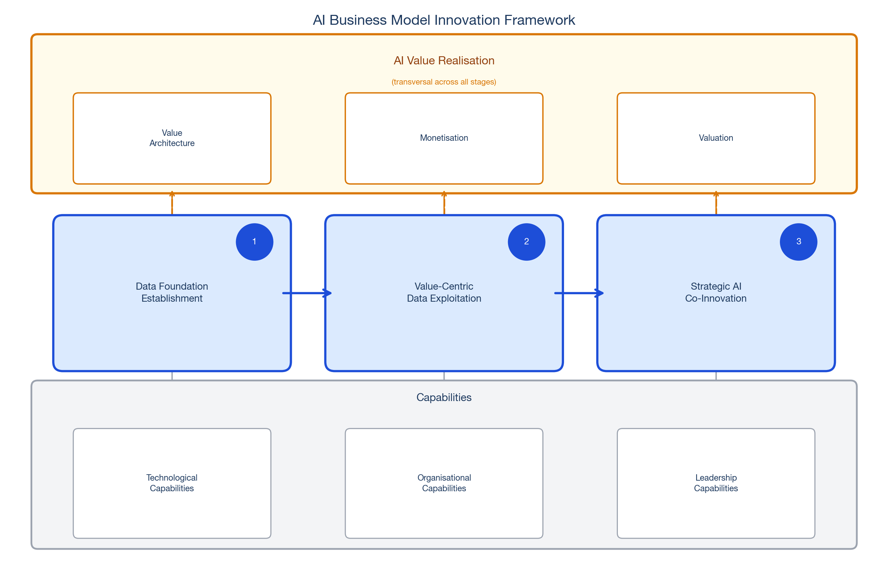

The 80% of organisations running AI pilots and the 5% extracting measurable value: that gap appeared in [Part 1](../03/index.qmd) and ran through [Part 2](../04/index.qmd). Those two posts made the case that the gap is a strategy gap, that most AI initiatives fail because they lack a diagnosed crux, a real guiding policy, or coherent actions pointed at the right obstacle. That case holds. But it is not the whole story.

Some organisations have built exactly the kind of kernel-anchored, roadmap-driven AI strategy that Parts 1 and 2 describe. They have diagnosed a real crux. They have built a guiding policy with review points designed in. Their pilots are coherent rather than scattered. And they are still not capturing value at the business level. Strategy and roadmap are necessary. They are not sufficient. The missing layer is the business model.

Osterwalder and Pigneur [@Osterwalder2010] define a business model as the mechanism by which an organisation creates, delivers, and captures value. A strategy tells you where to go and how to navigate. A business model tells you how value flows: who it is created for, how it reaches them, and how the organisation captures enough of it to sustain the work. In most technology waves, the distinction between strategy and business model is manageable. AI makes it structural. AI changes all three dimensions simultaneously, and in ways that most existing business models were not designed for. Without a framework built to handle that, a coherent AI strategy can still produce no measurable revenue, no sustainable competitive position, and no clear answer to why the investment existed at all.

That is what this post addresses. The AI Business Model Innovation Framework translates strategic direction into a business model that can actually capture AI value. It does not replace the roadmap from Part 2. It operates one layer beneath it, addressing the mechanism that the roadmap alone cannot provide.

## Why AI Breaks Existing Business Models

Before presenting the framework, it is worth being precise about what makes AI disruptive to business models specifically, not just to strategy.

The three structural AI properties from Part 1 each has a direct business model expression. The inverted diagnostic sequence means organisations often discover what AI can do before they have a clear value proposition for any specific customer segment. The result is a product that describes itself rather than solving a named problem for a named buyer. The policy decay problem means that revenue models calibrated to AI capabilities in one period can become structurally wrong before the product reaches scale. And the emergent, indirect nature of AI value means that the moments when value is created, a better decision, a faster resolution, a compounding feedback loop, are rarely the same moments when revenue is recognised. Business models built on conventional cause-and-effect between product delivery and payment are a poor fit for all three.

The clearest illustration of what this looks like at scale is Amazon Alexa. By any technical measure, Alexa was an extraordinary AI product: world-class voice recognition, deep platform integration, and a hardware ecosystem deployed in hundreds of millions of homes. The AI strategy was coherent. The platform was genuinely capable. But the business model never held. Users engaged with Alexa overwhelmingly for free tasks: timers, weather, music playback. The value Amazon needed to capture, commerce, subscriptions, paid services, never materialised at the scale the platform required. By 2022, the division was estimated to be losing ten billion dollars annually [@AmazonAlexa2022]. Amazon restructured in 2023, eliminating hundreds of roles and acknowledging, without quite saying it, that the business model had no coherent path to monetisation.

The question that was never seriously answered before the platform was built: what specific, diagnosed obstacle would voice AI uniquely resolve for a customer willing to pay for the resolution? That is not a strategy question. It is a business model question. And organisations that treat the two as the same thing reliably end up building Alexas.

## The AI Business Model Innovation Framework

The **AI Business Model Innovation Framework** is built around four elements: Data Foundation Establishment, Value-Centric Data Exploitation, Strategic AI Co-Innovation, and AI Value Realisation. The first three are roughly sequential. The fourth is transversal: it runs through all three stages rather than sitting at the end as a measurement exercise. That structural distinction matters. Most organisations treat value realisation as a reporting layer, something to build once the product is live. In AI, that sequence produces the same failure mode every time. Value realisation must be designed in from the start, at the same time as the data foundation, not retrofitted after the platform is built.

{#fig-bmi-framework fig-align="center" width="100%"}

@fig-bmi-framework shows the four elements and their relationships. The remainder of this section walks through each one.

### Element 1: Data Foundation Establishment

The data foundation is the pre-condition for everything that follows. In roadmapping terms, it maps directly onto Part 2's Step 2: a candid assessment of where the organisation actually stands on data maturity, infrastructure, and governance.

In business model terms, the data foundation is something more than a technical prerequisite. In Helmer's [@Helmer2016] framework, proprietary data is a **Cornered Resource**: an asset competitors cannot easily buy or replicate. The data foundation stage is where that resource is either built or forfeited. Organisations that treat it as infrastructure to be cleaned up later are not just accumulating technical debt. They are forfeiting a source of competitive advantage that compounds over time. An organisation that governs its data well, integrates it across disparate systems, and aligns it with business objectives is not simply ready for AI. It is building a position others cannot easily copy.

The key activities at this stage: developing or revisiting data strategy and governance, identifying relevant internal and external data sources, building data pipelines and integration solutions, and conducting regular quality audits. @Deloitte2025 identifies overestimating data maturity as the primary cause of AI pilot failure. Organisations assume their data is cleaner and better governed than it actually is. The gap surfaces after budgets are committed and timelines are set. Completing this element honestly is what prevents that. The investment in data foundation is not a cost to minimise. It is the strategic asset the rest of the framework depends on.

### Element 2: Value-Centric Data Exploitation

Building on the data foundation, this element focuses on extracting actionable insight from data and aligning that insight with business goals. The label is deliberate. This is not data exploitation in the technical sense of running queries. It is value-centric, meaning that every analytical activity is anchored to a specific business objective rather than run as a general survey of what the data might reveal.

@opresnik2015value describes this as the stage where data moves from asset to instrument. The distinction matters because data without a business question it is answering is just storage. The insight that emerges from value-centric exploitation becomes the foundation for AI model development and the raw material for new product-service offerings.

The key activities here connect directly to the guiding policy from Part 2. Developing or refining an AI strategy at this stage means aligning the analytical direction with the crux identified in the roadmapping process. Strengthening AI governance, conducting data transformation and knowledge extraction, and prototyping new offerings: each is a translation of strategic intent into something the business model can be built around.

::: {.callout-note appearance="simple"}
**Example:** A logistics company with a diagnosed crux around last-mile delivery unpredictability does not run a general analysis of its data estate. It focuses specifically on route, weather, and demand data that can inform dynamic scheduling. Every extraction decision is tested against one question: does this insight help resolve the crux? That discipline is what separates value-centric exploitation from data exploration with a budget attached.
:::

The output of this element is not a cleaned dataset. It is a set of validated insights that can anchor a value proposition, and a prototype that tests whether those insights translate into something a specific customer segment would pay to have.

### Element 3: Strategic AI Co-Innovation

The third element is where insight becomes product and where the business model is actually redesigned. It goes beyond optimising existing operations to developing AI-powered offerings that can disrupt traditional business models entirely.

The distinction between two modes of AI deployment is important here. **Task augmentation** uses AI to improve existing processes: faster document processing, more accurate demand forecasting, reduced customer resolution time. **Autonomous systems** use AI to enable entirely new products and services that did not exist before. Both are legitimate paths, but they imply fundamentally different business models, different revenue structures, different cost architectures, and different competitive positions.

Klarna's AI assistant [@Klarna2024] illustrates the difference. The organisation did not use AI to make its existing customer service team faster. It replaced the equivalent of 700 agents with a system that handled two-thirds of all customer service chats within the first month. That is not task augmentation with better tooling. That is a new operating model with a different cost structure and a different basis for value capture. The business model changed. The strategic roadmap alone would not have produced that outcome. Co-innovation, with partners and with the AI capability itself, is what reshaped the model.

The key activities: developing AI strategy and governance aligned with co-innovation goals, identifying opportunities for task augmentation and autonomous systems, establishing strategic partnerships, and launching AI-powered offerings in controlled environments before full deployment. External partnerships are particularly important at this stage. Organisations rarely have the full range of capabilities required for genuine AI co-innovation internally. The willingness to co-design with partners rather than build in isolation consistently distinguishes the organisations that reshape their business models from those that produce incremental improvements.

Coherent actions at this element are question-driven, exactly as Part 2 described. Each experiment should test a specific assumption about a specific obstacle. Co-innovation without that discipline produces a portfolio of technically impressive capabilities with no coherent value proposition connecting them.

### Element 4: AI Value Realisation

AI Value Realisation is not a final stage. It is a discipline that must be active throughout the entire framework: from the moment the data foundation is being designed, through exploitation and co-innovation, to the point where products are in the market. Treating it as a stage to be reached is precisely the failure mode that produced IBM Watson Health's measurement problem, tracking agreement rates with oncologists rather than clinical outcomes, and Amazon Alexa's revenue problem, counting device activations rather than value captured per user.

The element has three interdependent components: **Value Architecture**, **Monetisation**, and **Valuation**.

Value Architecture ensures that AI initiatives are designed around a clear value proposition for a specific customer segment. It asks the questions that most AI projects avoid until after launch: who is this for, what specific problem does it solve for them, how does it differentiate from what competitors offer, and how is that differentiation communicated clearly? Without value architecture, the AI initiative has no anchor in a customer's actual decision-making. The product works technically but has no buyer.

Monetisation translates value architecture into a revenue model. The key discipline is that this work must happen before development commitments are made, not after. Defining revenue streams, building sustainable cost structures, and integrating AI initiatives with long-term business strategy: all of this is harder to retrofit than to design in. Palantir is the clearest example of monetisation designed from the beginning. Their contracts are structured around outcomes rather than platform access. Customers pay for problems solved, not for software licensed. That revenue model forced the organisation to be precise about what problems it was actually solving before it could price the solution. The business model and the diagnostic discipline reinforced each other.

Valuation closes the loop. In AI, conventional KPIs track the wrong layer. Model accuracy, deployment counts, and agreement rates with human experts are technology metrics, not business metrics. As @Iansiti2020 show, AI value accumulates through embedded workflows and improved decisions at scale, not at the point of model deployment. The KPIs that matter are the ones that answer whether the crux has been resolved: decisions made faster, errors reduced, customer problems resolved at the front line. These are harder to measure and harder to attribute. They are also the only metrics that tell you whether the business model is working.

@tbl-value-realisation summarises the three components and the question each one forces.

| Component | Question It Forces | What Bad Looks Like |
|:---|:---|:---|
| Value Architecture | Who is this for, and what specifically does it solve? | Value proposition describes the technology, not the customer problem |
| Monetisation | How does the organisation capture value, and when is that decided? | Revenue model designed after the product is built |
| Valuation | Are we tracking outcomes or counting activity? | KPIs measure model performance, not business impact |

: **AI Value Realisation: Components, Questions, and Failure Modes** {#tbl-value-realisation}

## The Capabilities That Make It Work

The four elements require a foundation of technological, organisational, and leadership capabilities to operate. These are not additional steps in the framework. They are the conditions without which the framework cannot function.

Technological capabilities encompass data infrastructure, AI platforms, cloud computing, and analytics. Organisational capabilities focus on data-driven culture, AI talent, and governance structures. These provide the environment where AI can generate value rather than just output.

Leadership capabilities are the least discussed and the most consequential. As @Iansiti2020 argue, AI-native organisations do not simply adopt AI tools. They reorganise decision-making around AI-generated insight, moving authority from human hierarchies to algorithmic systems in specific, deliberate ways. That is a leadership decision, not a technology deployment. The organisations that capture AI value at scale are the ones where leaders understand the strategic implications of that reorganisation and drive it intentionally, rather than waiting for it to emerge as a byproduct of technology adoption.

The failure this capability gap produces is not a technology failure. It is a structural one: AI teams operating separately from commercial teams, each building a coherent case for their own priorities, neither having a complete picture of what the business model requires. The framework demands both in the same room, aligned on the same crux, designing value realisation together before either the data foundation or the product roadmap is committed.

## How to Spot a Bad AI Business Model

The four-element framework is also a diagnostic instrument. Applied to any AI initiative, it surfaces the failure modes that most organisations only discover after the investment is spent.

**The value proposition describes the technology, not the customer.** The organisation can articulate what its AI does but not what specific problem it solves for a specific buyer. IBM Watson Health's marketing described what Watson could do with natural language and clinical data. It never answered, clearly and honestly, what clinical outcome it was improving for which patient population in which care context. A value proposition built around a capability rather than a crux has no anchor in a purchasing decision.

**Monetisation is retrofitted.** The revenue model was designed after the product was built, which means it captures activity rather than value. Platform subscriptions, per-seat licensing, and usage fees charge for access to a capability rather than for the resolution of a problem. Outcome-linked revenue models require a precise answer to what the outcome is before the contract can be written. That discipline forces the diagnostic precision that activity-based models allow organisations to avoid. Organisations that retrofit monetisation consistently end up with a revenue model that the customer's buying process was never designed to accommodate.

**Valuation tracks the wrong layer.** KPIs are drawn from the technology layer: model accuracy, response times, deployment counts, pilot completions. None of these answer whether the crux has been resolved. An organisation can report impressive technology metrics and still have made no measurable difference to the business problem that justified the investment. This is not a measurement failure. It is a design failure: the valuation framework was built before the value architecture was clear, so it measured what was easy rather than what mattered.

**Capabilities are assembled without changing decisions.** The organisation hires AI talent, builds data platforms, and establishes governance structures. Leadership still makes the same decisions in the same ways using the same information it had before the AI initiative began. The technology is present. The organisational transformation that would allow it to generate value is not. This is what capabilities theatre looks like: the appearance of AI-native readiness without the decision-making restructuring that makes it real.

These four failure modes are not independent. An organisation without a clear value proposition will retrofit its monetisation because it has nothing precise to price. Retrofitted monetisation will default to activity metrics because outcomes were never defined. Activity metrics will not surface the absence of decision-level change, which means the capability gap persists invisibly until a competitor who built the model correctly makes the structural problem undeniable.

## Conclusion: Strategy, Roadmap, Business Model

Parts 1 and 2 established that the gap between 80% of organisations running AI pilots and 5% extracting measurable value is a strategy gap. That holds. But the strategy gap has a layer beneath it. Organisations that close the strategy gap with a kernel-anchored roadmap and then leave the business model unchanged are building a better-directed version of the same problem.

The AI Business Model Innovation Framework is what the roadmap requires beneath it. The data foundation is where the cornered resource is built or forfeited. Value-centric exploitation is where data becomes the basis for AI innovation rather than just cleaned and stored. Strategic co-innovation is where the business model is actually redesigned, not just improved. And AI Value Realisation, running through all three, is the discipline that ensures value architecture, monetisation, and valuation are designed together rather than retrofitted separately.

The three posts together form a complete arc. The kernel and the roadmap tell you where to go and how to navigate. The business model innovation framework tells you how value flows when you get there: who captures it, what it costs, and how you know it is working. Neither is sufficient without the other. Together, they are the structure that separates the 5% from the 80%.

The question is not whether to build the business model. It is whether to design it before the investment is committed or after it is spent.
